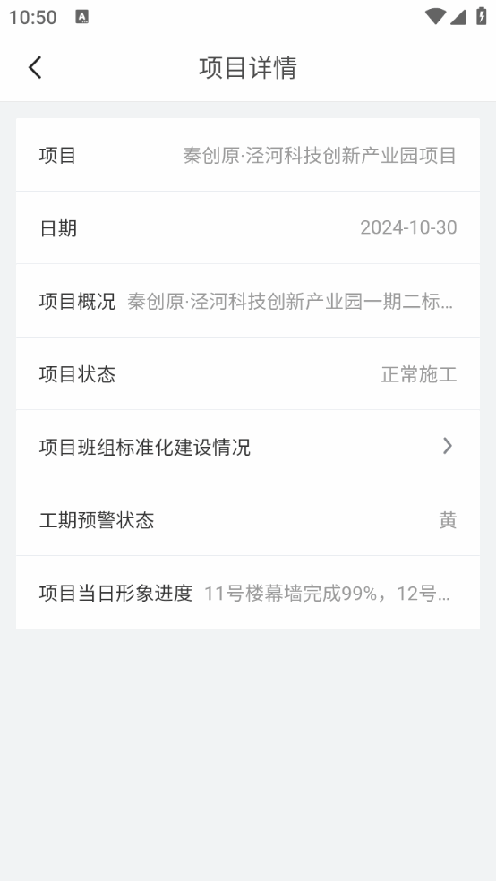

---
group:
  title: uniapp-mobile-components
  order: 2
---

# InfoLine

- uniapp 移动端单行展示组件
- 自动识别内容是否省略，省略了就使用 u-modal 展示.

示例图片

</img>

:::code-group

```vue | pure [示例]
<template>
  <div class="demoPage">
    <div class="list">
      <InfoLine
        v-for="item in list"
        :key="item.id"
        :label="item.label"
        :value="item.value"
        :arrow="item.arrow"
        @click="item.click"
      />
    </div>
  </div>
</template>

<script setup>
import { computed, ref } from 'vue';
import InfoLine from '@/components/InfoLine';
import { onLoad } from '@dcloudio/uni-app';

const data = ref({});

const mockData = {
  id: 10280,
  projectName: '项目1',
  projectSurvey:
    'XX项目位于XX市XX区XX街。项目总建筑面积XX㎡，其中地下XX㎡，地上XX㎡，包含新建XX栋XX层住宅、XX栋XX层办公楼***，以及室外管网、绿化等附属工程。中标合同额XX万元，开竣工日期20XX年X月X日-20XX年X月X日。中标单位：中铁十一局集团有限公司/中铁十一局集团建筑安装工程有限公司',
  planTeams: [
    {
      teamName: '1',
      teamManager: '1',
      teamLeader: '1',
      teamKpiUuid: 'b1dc009c-1f7e-8ace-8965-3c064179a353',
      teamKpiFileName:
        '工程项目数智化管理平台（一期）-用户使用手册V1.0 (1).pdf',
      teamKpiUrl:
        'https://zteejaoss.oss-cn-shenzhen.aliyuncs.com/b1dc009c-1f7e-8ace-8965-3c064179a353.pdf?Expires=1727837706&OSSAccessKeyId=LTAI5tP9d88Cm2GWTzKCPgeT&Signature=7%2F%2B8PAlArELyEO5QJTM6S1cRETQ%3D',
      fileExtension: '.pdf',
    },
    {
      teamName: '2',
      teamManager: '2',
      teamLeader: '2',
      teamKpiUuid: 'b1dc009c-28d0-8ace-8965-3c070e09c2bb',
      teamKpiFileName:
        '工程项目数智化管理平台（一期）-用户使用手册V1.0 (1).pdf',
      teamKpiUrl:
        'https://zteejaoss.oss-cn-shenzhen.aliyuncs.com/b1dc009c-1f7e-8ace-8965-3c064179a353.pdf?Expires=1727837706&OSSAccessKeyId=LTAI5tP9d88Cm2GWTzKCPgeT&Signature=7%2F%2B8PAlArELyEO5QJTM6S1cRETQ%3D',
      fileExtension: '.pdf',
    },
  ],
  dangerTypes: [
    {
      dangerType: 600,
      dangerTypeName: '基坑支护、降水工程',
    },
    {
      dangerType: 602,
      dangerTypeName: '模板工程及支撑体系',
    },
    {
      dangerType: 603,
      dangerTypeName: '起重吊装及安装拆卸工程',
    },
    {
      dangerType: 604,
      dangerTypeName: '脚手架工程',
    },
    {
      dangerType: 610,
      dangerTypeName: '预应力工程',
    },
  ],
};

const list = computed(() => {
  const {
    projectSurvey,
    dangerTypes = [],
    planTeams,
    projectName,
  } = data.value;
  return [
    {
      label: '项目',
      value: projectName,
    },

    {
      label: '项目概况',
      value: projectSurvey,
    },

    {
      label: '项目班组标准化建设情况',
      value: '',
      arrow: !!planTeams,
      click: () => {
        console.log('sss');
      },
    },
    {
      label: '危大工程施工类型',
      value: (dangerTypes || []).map((item) => item.dangerTypeName).join(','),
    },
  ];
});

const getData = async (params) => {
  return new Promise((res, rej) => {
    setTimeout(() => {
      data.value = mockData;
      res();
    }, 1000);
  });
};

onLoad(() => {
  getData();
});
</script>

<style lang="scss" scoped>
.demoPage {
  padding: 24rpx;
  .list {
    background-color: #fff;
  }
}
</style>
```

```vue | pure [源码（InfoLine.vue）]
<template>
  <div class="infoLine" @click="lineClick">
    <div class="left">
      {{ props.label }}
    </div>

    <div ref="valueDomRef" class="value">
      {{ props.value }}
    </div>

    <div class="arrow" v-if="props.arrow">
      <u-icon color="#85888e" name="arrow-right"></u-icon>
    </div>

    <u-modal
      :show-confirm-button="false"
      :show-cancel-button="false"
      :show-title="false"
      :content="`${props.value}`"
      v-model="detailModalShow"
      :mask-close-able="true"
    >
    </u-modal>
  </div>
</template>
<script setup>
import { ref } from 'vue';

const props = defineProps({
  label: {
    type: String,
    default: '',
  },
  value: {
    type: [String, Number],
    default: '',
  },
  // 右侧箭头
  arrow: {
    type: Boolean,
    default: false,
  },
  // 文字被省略时展示弹窗框 当有click 事件时 此属性将失效
  showDetailWhenOverflow: {
    type: Boolean,
    default: true,
  },
});

const emit = defineEmits(['click']);

const valueDomRef = ref();
const detailModalShow = ref();

// 判断文字是否有被省略
const getIsEllipsized = (element) => {
  if (!element) return false;
  return element.scrollWidth > element.clientWidth;
};

const lineClick = () => {
  if (emit('click')) {
    return;
  }

  const isEllipsized = getIsEllipsized(valueDomRef.value);
  if (isEllipsized && props.showDetailWhenOverflow) {
    detailModalShow.value = true;
  }
};
</script>

<style lang="scss" scoped>
.infoLine {
  text-overflow: ellipsis;
  box-sizing: border-box;
  display: flex;
  width: 100%;
  align-items: center;
  padding: 32rpx;
  border-bottom: 1rpx solid #e4e7ed;
  .left {
    margin-right: 16rpx;
    color: #333333;
  }

  .value {
    text-align: right;
    color: #999999;
    flex: 1;
    overflow: hidden;
    text-overflow: ellipsis;
    white-space: nowrap;
  }
  .arrow {
    margin-left: 8rpx;
  }
}
</style>
```

:::
